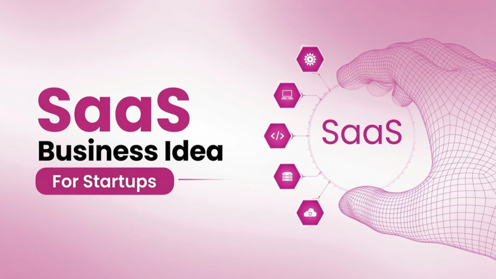

# AI Agent Lab — SaaS



Run the AI Agent Lab as a hosted service for your customers.

The **AI Agent Lab** is a complete environment where an AI agent, **Claude Code**, works alongside a time-series database, **QuestDB**, and live dashboards, **Grafana**.

This repository is for the **SaaS entrepreneur** — a small team is enough to launch: a marketer to bring the customers, and a DevOps engineer to deploy, operate, and support it.  

Instead of asking customers to install and operate anything, you host the AI Agent Lab and deliver it as an online service. Your customers simply sign up and use it in the browser — no servers, no setup, no operations on their side.

You handle the hosting, scaling, updates, and customer support.

They get the product.


## Where to Start

Full setup and documentation are available in each repository:

- [AI Agent Lab](https://github.com/quantiota/AI-Agent-Lab) — the core lab. Start here.
- [AI Agent Host](https://github.com/quantiota/AI-Agent-Host) — the production-ready, Claude Code-powered edition.
- [SaaS Template](https://quantiota.ai) — the landing page, ask for demo, and more..


## Why Offer It as a SaaS?

- **Zero friction for customers**  
  They access it over the web. Nothing to install, configure, or maintain.

- **You own the service**  
  Host it, brand it, operate it, and run it as your own product.

- **Open source under the MIT license**  
  Free to build your SaaS on top of.


## What I Provide

A SaaS template built on top of the AI Agent Lab.

This template is the starting base for your hosted service and already includes the core SaaS control plane:

- **Landing page**
- **Contact form**
- **Auth0 authentication**
- **Stripe Checkout**
- **Stripe webhook**
- **Customer Portal**
- **Billing and invoice access**
- **Local customer database**
- **Subscription status tracking**
- **Support Ticket for subscribed users**

The customer workflow is already in place:

```text
Sign up → Pay → Subscription active → Customer Portal → Billing / invoices
```
The template is therefore ready for SaaS validation and customer onboarding in test mode or production mode.

The only major component not included yet is automated cloud provisioning of customer AI Agent Lab instances.


## What You Add

- **AWS provisioning backend**  
  Automated provisioning of customer AI Agent Lab instances after successful payment.

- **Customer instance management**  
  Per-customer subdomain, secrets, TLS certificates, backups, and service lifecycle management.

- **Operational support**  
  Monitoring, updates, backups, recovery, and customer support for the hosted instances.


## Target User

This repository is designed for entrepreneurs or developers who want to launch the AI Agent Lab as a hosted SaaS product.

Customers do not need to understand Docker, servers, QuestDB, Grafana, or cloud operations.

They simply use the service in the browser.

## Contact

Questions, ideas, or interested in building your SaaS on this?

- Open an [issue](https://github.com/quantiota/AI-Agent-Lab-SaaS/issues) or start a [discussion](https://github.com/quantiota/AI-Agent-Lab-SaaS/discussions).
- Or reach out via [GitHub](https://github.com/quantiota).